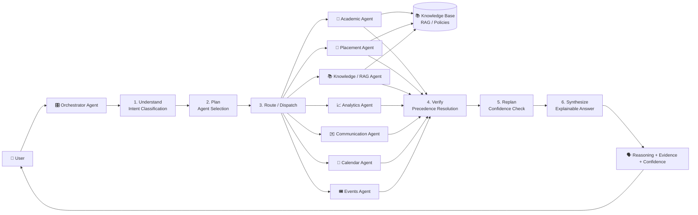
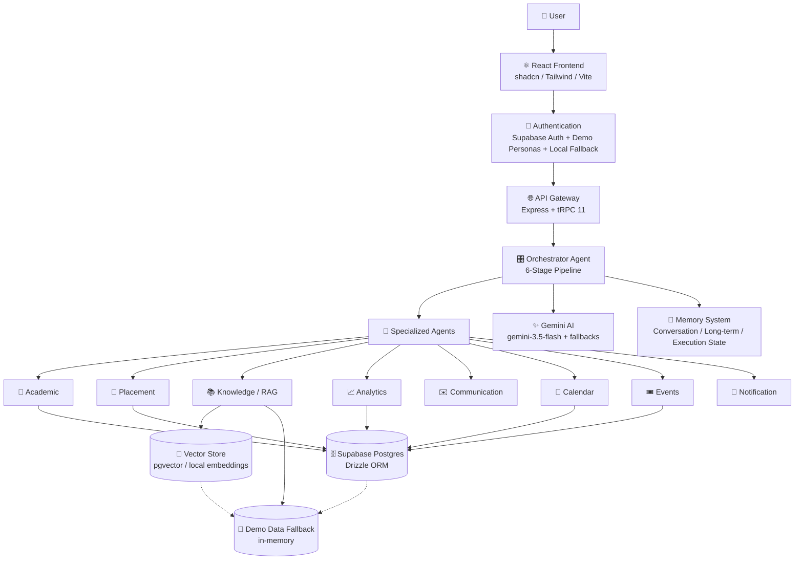

<div align="center">

# 🎓 Campus Intelligence OS

### An Autonomous Multi-Agent AI Smart Campus Operating System

**Built for the AgentX National Level Hackathon 2026**

`React` · `TypeScript` · `Express` · `tRPC` · `Gemini` · `Supabase` · `Tailwind CSS` · `Vite`

[](https://react.dev)
[](https://www.typescriptlang.org)
[](https://nodejs.org)
[](https://expressjs.com)
[](https://ai.google.dev)
[](https://supabase.com)
[](https://tailwindcss.com)
[](https://vitejs.dev)
[](https://trpc.io)
[](LICENSE)

**A campus that thinks for itself.** Students, faculty and principals each get an autonomous AI operating system that understands policy, reasons across specialized agents, and explains every decision.

</div>

---

## 📑 Table of Contents

- [🚀 Introduction](#introduction)
- [🤔 Problem Statement](#problem-statement)
- [💡 Why This Project](#why-this-project)
- [✨ Key Features](#key-features)
- [🧠 Multi-Agent Architecture](#multi-agent-architecture)
- [🔄 Workflow Diagram](#workflow-diagram)
- [🏗️ Architecture Diagram](#architecture-diagram)
- [🛠️ Technology Stack](#technology-stack)
- [📷 Screenshots](#screenshots)
- [🎥 Demo Video](#demo-video)
- [🏆 Built for AgentX National Hackathon 2026](#built-for-agentx-national-hackathon-2026)
- [📦 Installation](#installation)
- [🔑 Environment Variables](#environment-variables)
- [📁 Project Structure](#project-structure)
- [🤖 AI Workflow Example](#ai-workflow-example)
- [✅ Hackathon Requirements Mapping](#hackathon-requirements-mapping)
- [🔮 Future Scope](#future-scope)
- [👥 Team](#team)
- [📄 License](#license)

---

## 🚀 Introduction

> **Campus Intelligence OS** is an autonomous multi-agent AI operating system for educational institutions.

Traditional campus portals are *reactive* — they store data and wait for you to find it. Campus Intelligence OS is *proactive*: a fleet of specialized AI agents — Academic, Placement, Knowledge/RAG, Analytics, Communication, Calendar, Events and Notification — collaborate under a central **Orchestrator Agent** to answer questions, execute workflows, and deliver personalized intelligence to every role on campus.

Built on a **six-stage explainable orchestration pipeline** (Understand → Plan → Route → Verify → Replan → Synthesize), the platform combines:

- 🧠 **Gemini-powered reasoning** with automatic model fallbacks
- 📚 **RAG knowledge retrieval** grounded in institutional policy documents
- 🏛️ **Role-based access** across Student, Faculty and Principal dashboards
- ✅ **Approval workflows** where high-impact actions require sign-off
- 🗣️ **Explainable AI** — every answer shows its reasoning, evidence and confidence

Designed, engineered and shipped as a submission for the **AgentX National Level Hackathon 2026**.

---

## 🤔 Problem Statement

Campus life today runs on fragmented, disconnected tools that bury critical information:

- 📉 **Attendance and academics** are scattered across portals, spreadsheets and notice boards — students discover problems only *after* they become crises.
- 🧭 **Career opportunities** (internships, placements, workshops) are announced inconsistently, and students miss deadlines they were eligible for.
- 🏢 **Faculty and administrators** juggle manual tracking — who needs intervention, which approvals are pending, how departments actually compare — with no unified view.
- 🔍 **Institutional policy** lives in long documents nobody has time to read, so students and staff guess instead of knowing.
- 🤷 **No personalization** — every user sees the same generic portal regardless of role, standing or goals.

The result: **high-friction, high-anxiety campus operations** where the institution's own intelligence is locked inside silos.

---

## 💡 Why This Project

Traditional campus portals are insufficient because they are **reactive databases with login screens**, not assistants. Campus Intelligence OS reimagines the campus portal as an **autonomous operating system**:

| Traditional Portal | Campus Intelligence OS |
|---|---|
| You search for information | Agents bring it to you proactively |
| One-size-fits-all dashboards | Role- and standing-personalized views |
| Static FAQ answers | **Explainable AI** with reasoning + evidence + confidence |
| Policy PDFs nobody reads | **RAG** answers grounded in actual policy text |
| Manual approval chains | **Workflow automation** with role-based gates |
| Separate calendars/events/notices | One intelligent, cross-linked campus OS |

Autonomous agents **continuously analyze the campus context** — attendance trends, eligibility criteria, deadlines, departmental KPIs — and act: recommending internships, flagging at-risk students, scheduling registrations, and escalating decisions to the right approver. The result is a campus where **the right information reaches the right person at the right time**, with the reasoning shown.

---

## ✨ Key Features

- 🧠 **Multi-Agent AI Orchestration** — a 6-stage pipeline (Understand → Plan → Route → Verify → Replan → Synthesize) dispatches queries across specialized agents
- ✨ **Gemini-powered AI Assistant** — real-time reasoning with automatic model fallback (`gemini-3.5-flash` → `gemini-flash-latest` → `gemini-2.0-flash`)
- 🎓 **Student Dashboard** — attendance trends, timetable, performance vs. class average, CGPA, internal marks, semester progress, resume score, assignments, exams, clubs, workshops, scholarships, fees
- 🏫 **Faculty Dashboard** — class management, attendance analytics, at-risk students, assignment review, leave approvals, announcements, department performance, personal tasks
- 🏛️ **Principal Dashboard** — institution analytics, department attendance, placement & internship statistics, faculty metrics, student insights, grievances, budget overview, AI recommendations
- 🔐 **Personalized Login & Signup** — full name, email, password + role picker; dashboards greet the logged-in user by name
- 🧪 **Demo Personas** — one-click Student / Faculty / Principal access with seeded data (no account required)
- 🗣️ **Explainable AI** — every response includes reasoning, evidence with citations, confidence scores and rejected alternatives
- 📚 **RAG Knowledge Retrieval** — institutional policies chunked, embedded (`all-MiniLM-L6-v2`) and retrieved via pgvector, with keyword-scored demo fallback
- ✅ **Approval Workflow** — high-impact actions queue for role-based Approve / Reject
- 📅 **Calendar** — day / week / month views with role-scoped auto-generated events (classes, exams, meetings, deadlines)
- 🎟️ **Event Registration** — browse workshops, hackathons, seminars, placement drives; register with confirmation + calendar sync
- 🔔 **Notification Center** — persona-scoped feeds with unread badges and mark-all-read
- 📊 **Attendance Analytics** — trends, per-course rates, department comparisons
- 💼 **Internship Recommendations** — AI-matched opportunities with eligibility scoring
- 🏢 **Placement Intelligence** — eligibility-verified openings and placement statistics
- 🎯 **Academic Insights** — standing flags, intervention needs, performance analytics
- 🖥️ **Executive Dashboard** — institution-wide KPIs, alerts and AI-generated recommendations
- 🛡️ **Graceful AI Fallback** — deterministic local intelligence when Gemini is unavailable or rate-limited; demo mode never breaks
- 📱 **Responsive UI** — shadcn/ui + Tailwind + Framer Motion, polished for mobile through desktop

---

## 🧠 Multi-Agent Architecture

Campus Intelligence OS runs a **collaborative society of agents** coordinated by an orchestrator. Each agent is a focused reasoning module with a single responsibility.

### 🎛️ Orchestrator Agent
The central coordinator. Runs the **six-stage pipeline**: classifies intent (Understand), builds an action plan (Plan), dispatches to the right agents (Route), resolves conflicts by precedence (Verify), patches weak steps (Replan), and composes the final explainable response (Synthesize). It holds conversation memory, long-term facts and shared context between stages.

### 📘 Academic Agent
Analyzes courses, grades, attendance and academic standing. Flags probation, computes averages, and surfaces intervention needs — grounding every claim in the student's actual records.

### 💼 Placement Agent
Screens career opportunities (internships, placements, fellowships) against the student's academic standing and eligibility criteria, returning an eligibility verdict with evidence.

### 📚 Knowledge/RAG Agent
Answers policy questions strictly from institutional documents. Retrieves relevant chunks from the vector store (or a keyword-scored demo corpus) and cites them — never hallucinating beyond the source material.

### 📈 Analytics Agent
Derives metrics and insights — attendance averages, good-standing vs. probation counts, trends — and explains *why* a number matters.

### ✉️ Communication Agent
Drafts role-appropriate communications (emails, notices) and flags when a message crosses an approval threshold.

### 📅 Calendar Agent
Reads the auto-generated role-scoped schedule (classes, exams, meetings, deadlines, registered events) and answers "what's on today / this week?"

### 🎟️ Events Agent
Browses the campus event catalog, recommends matches, and — on registration intent — actually registers the user, adds the event to the calendar and triggers a confirmation notification.

### 🔔 Notification Agent
Manages persona-scoped notification feeds with read/unread state; fires confirmations, alerts and reminders as workflows complete.

### 🤝 How They Collaborate

1. A user query enters the **Orchestrator**.
2. The **Understand** stage classifies intent (academic / career / policy / analytics / communication / events / calendar).
3. The **Plan** stage selects the agents required — *multiple agents for multi-part queries* — with a deterministic keyword layer guaranteeing the right set is always dispatched.
4. The **Route** stage invokes each chosen agent in parallel; every agent returns `{ result, evidence, confidence, source_type }`.
5. The **Verify** stage resolves conflicts via precedence (`Knowledge > Academic > Career > Analytics > Events > Calendar > Communication`).
6. The **Synthesize** stage composes the final answer with reasoning, citations and confidence — or, if the LLM is unavailable, merges the best agent results so the system **never goes dark**.

---

## 🔄 Workflow Diagram



---

## 🏗️ Architecture Diagram



> **Note:** When Supabase is not configured, every layer falls back to rich in-memory demo data — the application never blocks on missing credentials.

---

## 🛠️ Technology Stack

| Layer | Technology |
|---|---|
| **Frontend** | React 19 · TypeScript · Vite 7 · Tailwind CSS 4 · shadcn/ui · Framer Motion · Recharts · lucide-react |
| **Backend** | Node.js 22 · Express 4 · tRPC 11 · Zod |
| **Database** | Supabase Postgres · Drizzle ORM · postgres-js · pgvector |
| **AI** | Google Gemini (`gemini-3.5-flash`, automatic fallbacks) · local embeddings (`@xenova/transformers` / all-MiniLM-L6-v2) |
| **Authentication** | Supabase Auth (email/password + persona metadata) · in-memory local fallback · one-click demo personas · JWT sessions (jose) |
| **Deployment** | Freebuff-managed hosting (Vite static + Node server) · GitHub Actions-ready |

---

## 📷 Screenshots

> Replace the placeholders below by dropping screenshots into `docs/screenshots/` (see [Project Structure](#-project-structure)).

| Home Page | Student Dashboard |
|:---:|:---:|
|  |  |

| Faculty Dashboard | Principal Dashboard |
|:---:|:---:|
|  |  |

| AI Chat | Calendar |
|:---:|:---:|
|  |  |

| Events | Notifications |
|:---:|:---:|
|  |  |

---

## 🎥 Demo Video

**Coming soon.**

> Paste your YouTube or Google Drive link here after recording:
> `https://youtube.com/...` or `https://drive.google.com/...`

---

## 🏆 Built for AgentX National Hackathon 2026

**Campus Intelligence OS** was built as a submission for the **AgentX National Level Hackathon 2026** to demonstrate an **Autonomous Multi-Agent Smart Campus Operating System** that combines:

- 🧠 Autonomous reasoning and **multi-agent orchestration**
- 📚 Retrieval-Augmented Generation grounded in institutional policy
- 🗂️ Long-term & conversation memory
- 🧭 Planning, tool calling and **workflow automation**
- 🗣️ Explainable AI with evidence, confidence and rejected alternatives
- 🎯 Personalized recommendations for every campus role

The project is a fully working product — not a mockup — with live authentication, three role dashboards, a real RAG pipeline, an approval workflow, a calendar, event registration, a notification center and a Gemini-powered assistant that degrades gracefully under rate limits.

---

## 📦 Installation

<details>
<summary><b>Click to expand — local setup (pnpm)</b></summary>

### Prerequisites

- [Node.js](https://nodejs.org) **22+**
- [pnpm](https://pnpm.io) **10+**
- A [Gemini API key](https://aistudio.google.com/apikey) *(optional — demo mode works without it)*
- A [Supabase](https://supabase.com) project *(optional — demo mode works without it)*

### 1. Install dependencies

```bash
pnpm install
```

### 2. Configure environment variables

Create a `.env.local` file (see [Environment Variables](#-environment-variables)) or set the values in the platform's Keys/API keys tab.

### 3. Set up the database *(optional — Supabase)*

```bash
# Generate + apply migrations
pnpm db:push

# Seed demo users, records, opportunities, approvals and RAG documents
pnpm db:seed
```

### 4. Run the development server

```bash
pnpm dev
```

The app starts at **http://localhost:3000** (or the next available port).

### 5. Validate

```bash
pnpm check   # TypeScript typecheck
pnpm test    # Vitest suite
pnpm build   # Production build (Vite + esbuild)
```

</details>

---

## 🔑 Environment Variables

<details>
<summary><b>Click to expand — full reference table</b></summary>

| Variable | Required | Description |
|---|---|---|
| `GEMINI_API_KEY` | ⭐ For AI chat | Google AI Studio / Gemini API key. Without it, the AI assistant returns a clear setup message and deterministic fallbacks engage. |
| `GEMINI_MODEL` | No | Optional model override. Defaults to `gemini-3.5-flash` (fallbacks: `gemini-flash-latest`, `gemini-2.0-flash`, `gemini-2.5-flash`). |
| `SUPABASE_URL` | No* | Supabase project URL (server-side auth/signup). |
| `SUPABASE_SERVICE_ROLE_KEY` | No* | Supabase `service_role` key (server-side only — never expose to the browser). |
| `VITE_SUPABASE_URL` | No* | Supabase project URL (browser client). |
| `VITE_SUPABASE_ANON_KEY` | No* | Supabase `anon`/public key (browser client). |
| `DATABASE_URL` | No* | Supabase Postgres connection string for Drizzle (users, records, RAG vectors). |
| `JWT_SECRET` | No | Session-cookie signing secret. A development fallback exists so demo login works before any keys are set — **always set this in production**. |
| `VITE_APP_ID` | No | Legacy Manus OAuth app id (optional). |
| `OAUTH_SERVER_URL` | No | Legacy Manus OAuth server URL (optional). |
| `VITE_OAUTH_PORTAL_URL` | No | Legacy Manus OAuth portal URL (optional). |

*\*Without Supabase variables the application runs entirely in **demo mode** with in-memory data — signup, login, dashboards, chat, calendar, events and notifications all keep working.*

</details>

---

## 📁 Project Structure

<details>
<summary><b>Click to expand — repository layout</b></summary>

```text
campus-intelligence-os/
├── client/                      # React frontend (Vite)
│   ├── src/
│   │   ├── pages/               # Home, Login, Student/Faculty/Principal dashboards,
│   │   │                        # Calendar, Events, Notifications
│   │   ├── components/          # UI kit (dashboard shell, cards, charts) + ExplainableChat
│   │   │   └── ui/              # shadcn/ui components
│   │   ├── lib/                 # tRPC client, Supabase client, demo datasets
│   │   └── _core/hooks/         # useAuth
│   └── index.html
├── server/                      # Node.js backend (Express + tRPC)
│   ├── _core/                   # Boot, context, auth SDK, env, cookies, session
│   ├── lib/
│   │   ├── llm/                 # Gemini adapter (model fallbacks, JSON mode)
│   │   ├── orchestrator/        # 6-stage multi-agent pipeline
│   │   ├── components/          # Academic, Placement, Knowledge/RAG, Analytics,
│   │   │                        # Communication, Calendar, Events agents
│   │   ├── rag/                 # Chunking, local embeddings, pgvector retrieval
│   │   ├── memory/              # Conversation, long-term, execution-state stores
│   │   └── demo/                # In-memory demo data, events, notifications, calendar
│   ├── routers.ts               # tRPC application router
│   └── db.ts                    # Drizzle database access
├── shared/                      # Shared types & constants
├── drizzle/                     # Schema + migrations
├── docs/screenshots/            # README screenshot placeholders
├── .env.local                   # Local dev env (gitignored)
└── package.json
```

</details>

---

## 🤖 AI Workflow Example

> **User query:** *"Am I eligible for the Google Internship?"*

| Step | Agent | What happens |
|---|---|---|
| 1 | **Understand** | The Orchestrator classifies the query as `career` (with academic and policy relevance). |
| 2 | **Plan** | The Orchestrator selects **Placement + Academic + Knowledge** agents — a single question that requires three expert perspectives. |
| 3 | **Route** | All three agents run with the user's real records: |
| | 📘 **Academic Agent** | Pulls attendance per course (e.g., 86% DS, 78.5% OS, 62% Discrete Math) and standing flags (probation in one course). |
| | 💼 **Placement Agent** | Loads the Google SWE Internship eligibility criteria (`minAttendance 75%`, good standing) and screens the student. |
| | 📚 **Knowledge/RAG Agent** | Retrieves the *Internship & Placement Policy* — probation students require department-head approval. |
| 4 | **Verify** | Precedence resolution merges the agents; policy takes priority where it applies. |
| 5 | **Replan** | Confidence is high — no replan needed. |
| 6 | **Synthesize** | Gemini composes: *"Not currently eligible — Discrete Mathematics is on probation (62%). You are eligible for the Open Source Contributor Program. With a faculty sponsor, you may apply to Google under the probation exception."* |

**Every step returns `reasoning`, `evidence` and `confidence`** — the user can always see *why* the system answered the way it did.

---

## ✅ Hackathon Requirements Mapping

| AgentX Requirement | How Campus Intelligence OS Satisfies It |
|---|---|
| **Multi-Agent Architecture** | 8 specialized agents (Orchestrator, Academic, Placement, Knowledge/RAG, Analytics, Communication, Calendar, Events) + Notification agent |
| **RAG** | Policy documents chunked → embedded (`all-MiniLM-L6-v2`) → retrieved via pgvector, with keyword-scored demo fallback |
| **Memory** | Conversation memory (per session), long-term facts, execution state, and in-process shared context |
| **Planning** | Orchestrator **Plan** stage selects the agents required for each query; deterministic keyword layer guarantees multi-agent dispatch |
| **Tool Calling** | Agents act on campus tools: event registration, calendar sync, notification dispatch, approval gating |
| **Workflow Orchestration** | 6-stage pipeline (Understand → Plan → Route → Verify → Replan → Synthesize) with precedence-based conflict resolution |
| **Explainable AI** | Every response includes reasoning, evidence with citations, confidence scores, and rejected alternatives |
| **Personalized Recommendations** | Role- and standing-aware dashboards: internship matching, club recommendations, intervention flags, AI institutional recommendations |
| **Context Awareness** | Persona-scoped access, academic records, department KPIs, calendar and event state inform every agent |
| **Error Handling** | Graceful AI fallback (deterministic local intelligence), demo-mode fallbacks, 429 retries with backoff, never blocks on missing credentials |

---

## 🔮 Future Scope

- 🎙️ **Voice AI** — natural-language voice interaction with the campus assistant
- 👁️ **Vision / OCR** — scan notices, transcripts and ID cards to ingest data visually
- 📱 **Mobile App** — native mobile experience with push notifications
- 🔌 **MCP (Model Context Protocol)** — expose campus tools as MCP servers for external AI agents
- 🌐 **Multilingual Support** — local-language campus communication and agent responses
- 🧑‍🏫 **Parent Portal** — guardian views with consent-based access
- 🏫 **Campus IoT** — smart classrooms and facilities integrated into the OS

---

## 👥 Team

| Role | Name | GitHub |
|---|---|---|
| Full-Stack / AI Engineer | _Your Name_ | [@your-handle](https://github.com) |
| Frontend Engineer | _Your Name_ | [@your-handle](https://github.com) |
| Product / Design | _Your Name_ | [@your-handle](https://github.com) |
| Research / Data | _Your Name_ | [@your-handle](https://github.com) |

---

## 📄 License

This project is licensed under the **MIT License** — see the [LICENSE](LICENSE) file for details.

---

<div align="center">

**Campus Intelligence OS** · Built with ❤️ for the AgentX National Level Hackathon 2026

*The campus that thinks for itself.*

</div>
